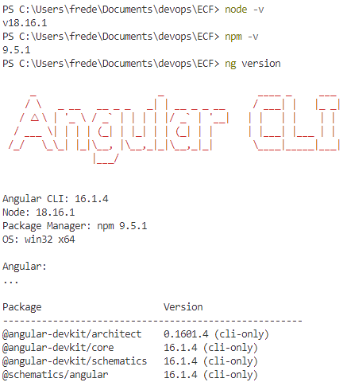
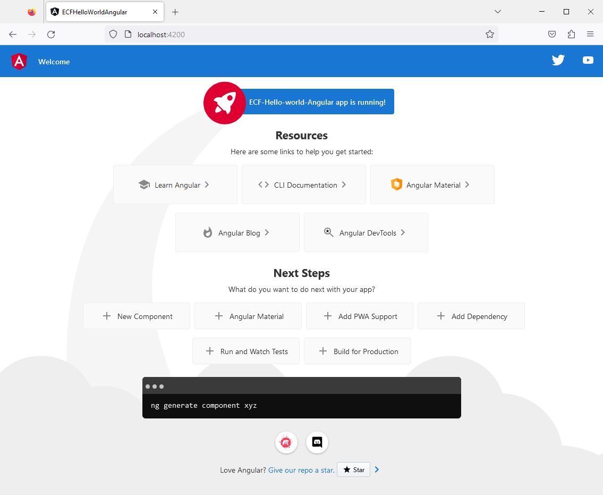
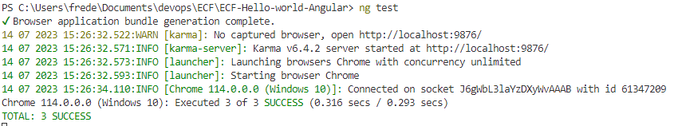
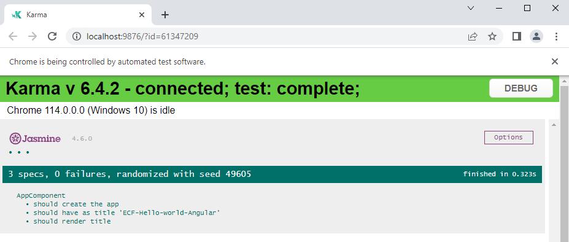
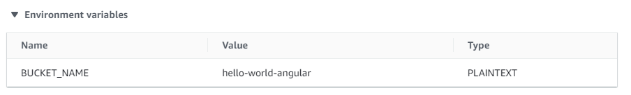

# ECF Hello World (Angular)
📅 [**Planning Notion**](https://mirror-paw-f24.notion.site/f2fa7cecae5a4cd4a1792bf963ec744a?v=b71bd3754f5541c1a7c1a23cbb2f1ca9) 📅  
___  
## Table of content
- [ECF Hello World (Angular)](#ecf-hello-world-angular)
  - [Table of content](#table-of-content)
  - [Activité Type 2 : Déploiement d’une application en continu](#activité-type-2--déploiement-dune-application-en-continu)
    - [4. Créez une application Angular (hello word)](#4-créez-une-application-angular-hello-word)
      - [4.1 Installation des dépendances](#41-installation-des-dépendances)
      - [4.2 Initialisation d'un projet angular](#42-initialisation-dun-projet-angular)
    - [5. Écrivez le script qui build/test et le Angular (circle ci est accepté)](#5-écrivez-le-script-qui-buildtest-et-le-angular-circle-ci-est-accepté)
      - [5.1 Commandes pour lancer des tests](#51-commandes-pour-lancer-des-tests)
      - [5.2 Construction d'un pipeline dans AWS CodePipeline](#52-construction-dun-pipeline-dans-aws-codepipeline)
      - [5.2 Construction d'un Build dans AWS CodeBuild](#52-construction-dun-build-dans-aws-codebuild)
      - [5.3 Construction d'un fichier buildspec.yaml](#53-construction-dun-fichier-buildspecyaml)
    - [Sources utilisées](#sources-utilisées)

## Activité Type 2 : Déploiement d’une application en continu

### 4. Créez une application Angular (hello word)

#### 4.1 Installation des dépendances

- Installation de Node.js et npm : [Page téléchargement Node.js](https://nodejs.org/fr/download)
- Installation d'angular : `npm i -g @angular/cli`

Vérification des versions :
``` ps
node -v
npm -v
ng version
```  
  

#### 4.2 Initialisation d'un projet angular

- Création d'un nouveau projet Angular avec la commande : `ng new ECF-Hello-world-Angular`  
- Compilation et lancement d'un serveur de développement : `ng serve`  
  
- Pour arrêter le serveur de développement, **CTRL+C** dans shell
- Pour visualiser l'application, ouvrir un navigateur à l'adresse `http://localhost:4200/`  
  
- Lancement du build du projet avec `ng build`.  
  L'artefact sera stocké dans le dossier ./dist/


### 5. Écrivez le script qui build/test et le Angular (circle ci est accepté)

#### 5.1 Commandes pour lancer des tests

- Pour lancer des tests unitaires avec Karma, on peut utiliser la commande `ng test`
  
Notre navigateur s'ouvre alors sur un résumé des tests unitaires


#### 5.2 Construction d'un pipeline dans AWS CodePipeline

On construit un pipeline avec les caractéristiques suivantes :  
- on créé une connexion avec notre repository githug
- on créé un projet Build (CodeBuild)

#### 5.2 Construction d'un Build dans AWS CodeBuild

Lors de la création d'un Pipeline, on est invité à créer un projet Build.  
On en créé un avec les caractéristiques suivantes :  
- on lui affecte un role avec la policy "AmazonS3FullAccess" pour pouvoir déposer l'application dans un bucket S3
- On créé une variable d'environnement qu'on pourra réutiliser dans notre fichier buildspec.yaml  
  

#### 5.3 Construction d'un fichier buildspec.yaml

Ajout du fichier [buildspec.yaml](buildspec.yaml), qui servira à CodeBuild pour les différentes étapes de build et de test.  


### Sources utilisées
[AWS - How to Run Headless Front-End Tests with AWS Cloud9 and AWS CodeBuild](https://aws.amazon.com/fr/blogs/devops/how-to-run-headless-front-end-tests-with-aws-cloud9-and-aws-codebuild/)   
[Angular - ng test](https://angular.io/cli/test)  